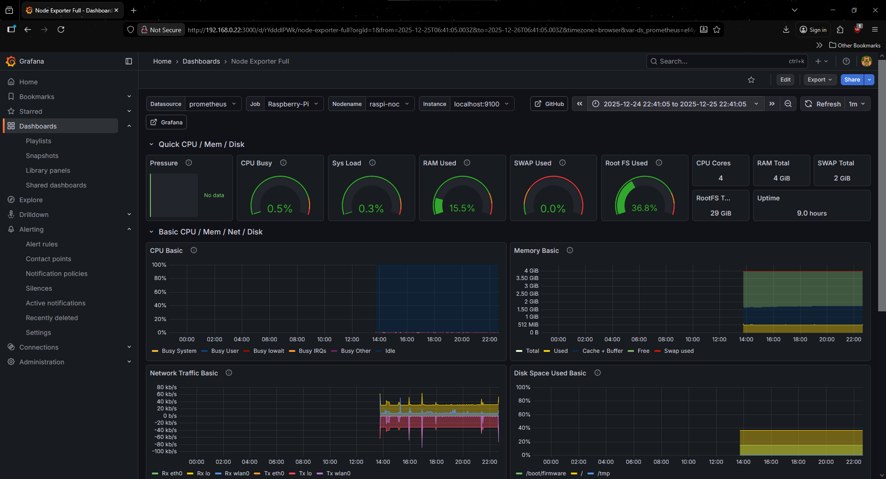
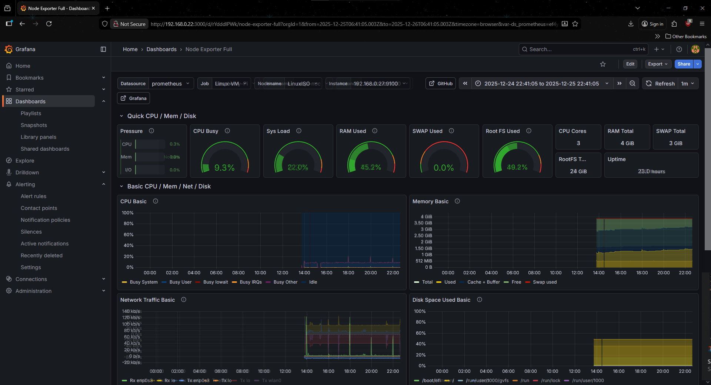

# Raspberry Pi & Linux VM Monitoring Stack

## Screenshots

*Top: Raspberry Pi metrics, Bottom: Linux VM metrics*

### Overview
This project demonstrates a basic monitoring stack commonly used in Network Operations Centers (NOCs). 
Prometheus is used to scrape metrics from multiple Linux systems, and Grafana is used for visualization.

### Architecture
- Raspberry Pi running:
  - Prometheus
  - Grafana
  - Node Exporter
- Linux Virtual Machine running:
  - Node Exporter

### Metrics Collected
- CPU utilization
- Memory usage
- Disk usage
- Network traffic
- System uptime
- Hardware temperature

### Access
- Grafana Web UI: http://<RaspberryPi-IP>:3000

### Files Included
- `grafana-dashboard.json` – Exported Grafana dashboard
- `prometheus.yml` – Prometheus scrape configuration
- `/screenshots` – Dashboard screenshots

### Skills Demonstrated
- Linux system administration
- Network monitoring
- Prometheus metric scraping
- Grafana dashboard creation
- TCP/IP networking fundamentals
